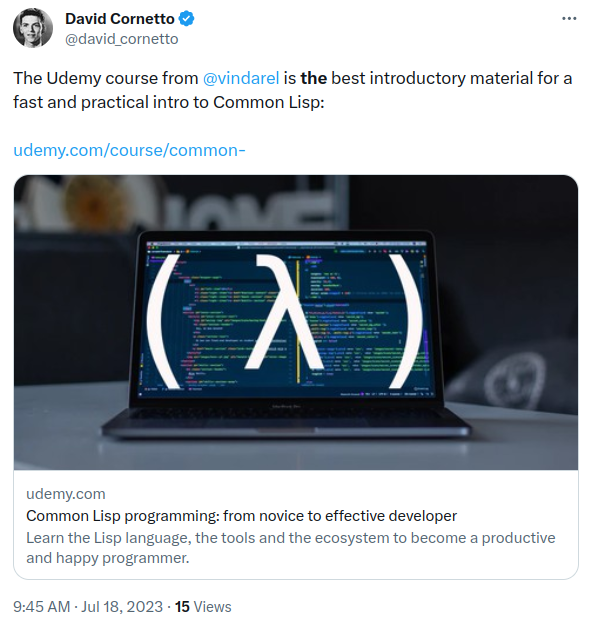

🕊

  <h2 align="center"> Common Lisp Programming Course </h2>
  <h3 align="center"> Learn Lisp efficiently, in videos </h3>

  <a href="https://www.udemy.com/course/common-lisp-programming/?referralCode=2F3D698BBC4326F94358"><b> The course </b></a> |
  <a href="https://lisp-journey.gitlab.io/"><b> Blog </b></a> |
  <a href="https://framapiaf.org/@vindarel"><b> Mastodon </b></a> |
  <a href="https://ko-fi.com/vindarel"><b> ko-fi </b></a>

  <h4> Learn the Lisp language and its ecosystem, become an effective programmer and learn how to write real-world applications. Avoid all the traps that I faced during my journey. </h4>

*NEW chapter: CLOS! Here's a [50% coupon for busy coders in 2025](https://www.udemy.com/course/common-lisp-programming/?couponCode=BUSYCODERS2025).* *If you are a student, drop me a line for a free link.*

  

Everyone, I really like Common Lisp, it is superior to many
languages out there (hello Python), but learning it isn't as easy as
it should be. Despite very good books, there aren't many online
resources, the language has its peculiarities, the ecosystem is
larger than you think but not well structured. I contributed a *lot*
to written resources such as the
[Cookbook](https://lispcookbook.github.io/cl-cookbook/),
[awesome-cl](https://github.com/CodyReichert/awesome-cl) and my
[lisp-journey blog](https://lisp-journey.gitlab.io/) but I want to do more.

You can now **learn Common Lisp with my [videos on the Udemy platform](https://www.udemy.com/course/common-lisp-programming/?referralCode=2F3D698BBC4326F94358)**. At the time of writing, I consider it ~~half done~~ 70% done (but the chapters there are complete). If you subscribe now, you'll have access to the new content that I'm working on. I truly believe this course to be **the most effective way to learn Common Lisp today**. I am genuinely happy to share all that with you.

This course is the result of my experience writing new material,
answering questions, writing libraries, software, demos, starter kits,
contributing to and starting ambitious projects (Nyxt, Lem, CIEL…)
and using CL in production© [^1]. I run my own small business [^2].

Be aware, however, that *the course is not for total beginners* in a
Lisp language. You must know what a Lisp language is, and have a
minimal programming experience (know what variables and functions
are). I don't teach "Lisp", although I give a quick overview of Lisp
basics, of course (syntax, evaluation model). But I quickly dive into
"the Common Lisp way". I prefer to teach advanced, real-world Common
Lisp concepts.

> [!NOTE]
> I now do one-to-one training sessions. I started in January of 2025 (thanks, Ari). We settled on USD 40$ an hour. You can contact me by email.

The course is to my relief well received. You'll find more feedback below, here's a recent one:

> I have done some preliminary Common Lisp exploration prior to this course but had a lot of questions regarding practical use and development workflows. This course was amazing for this! I learned a lot of useful techniques for actually writing the code in Emacs, as well as conversational explanations of concepts that had previously confused me in text-heavy resources. Please keep up the good work and continue with this line of topics, it is well worth the price!

@Preston, October of 2024 <3

According to learners, the areas I could improve are:
- give more practice activities (Udemy doesn't support Lisp in coding exercises though), and
- make the videos more engaging.

Points taken.

Also according to them, the criteria
- "Is the instructor knowledgeable about the topic?" tops at 97% satisfaction, and
- "Are you learning valuable information?" is at 91%.

Here's what you'll learn.

  

<!-- markdown-toc start - Don't edit this section. Run M-x markdown-toc-refresh-toc -->
**Table of Contents**

- [Content](#content)
    - [Introduction video](#introduction-video)
    - [Section 1: Getting Started](#section-1-getting-started)
    - [section 2: Lisp Basics](#section-2-lisp-basics)
    - [section 3: iteration](#section-3-iteration)
    - [section 4: all about functions](#section-4-all-about-functions)
    - [section 5: working with projects](#section-5-working-with-projects)
    - [section 6: the Condition Handling System](#section-6-the-condition-handling-system)
    - [section 7: the Common Lisp Object System (CLOS) (NEW! as of July, 2024)](#section-7-the-common-lisp-object-system-clos-new-as-of-july-2024)
    - [section 8: macros](#section-8-macros)
    - [Section 9: additional and optional](#section-9-additional-and-optional)
- [Who is this course for](#who-is-this-course-for)
- [How to best use this course if you are already a programmer](#how-to-best-use-this-course-if-you-are-already-a-programmer)
- [Index: external libraries and tools we meet on the course](#index-external-libraries-and-tools-we-meet-on-the-course)
- [Example sources](#example-sources)
- [Exercises](#exercises)
- [TODOs](#todos)
- [Demos on Youtube](#demos-on-youtube)
- [Issues](#issues)
- [Feedback](#feedback)
- [Conclusion](#conclusion)

<!-- markdown-toc end -->

# Content

*Total learning material: 7hr 12min and counting, in 51 lectures. Subtitles: english.*

*Current rating (2024-12): 4.71 / 5 -thank you!*

## Introduction video

> Short list of features. Companies using Common Lisp. Why this course.

> Everything that was hard to find for me is presented and explained to you.

## Section 1: Getting Started

1.1. Install SBCL **[🆓 FREE PREVIEW]**

> What we see: install the SBCL implementation (on a Debian system), start it, write "hello world", understand the output, add readline support to the SBCL default REPL in the terminal, disable the interactive debugger, a few words on Lisp implementations and GNU CLISP in particular.

1.2. Run Lisp code from your terminal, write code with a simple text editor

> What we see: we write a code snippet with a simple text editor and we run it with sbcl's --script and --load flags. We use the LOAD function to reload & recompile our file while we are still in the Lisp image.

1.4. Portacle: a portable, multiplatform, ready-to-use Common Lisp IDE

> Portacle allows to get started with a Common Lisp editor in 3 clicks, on Windows, MacOS and Linux. It provides: Emacs, SBCL, Quicklisp (the package manager), SLIME (the Superior Lisp Integration Mode for Emacs) as well as SLY, Git and Magit (the famous Emacs package). If you already know Emacs: you can stop watching at 9'. We first see: what is Portacle and where to get it, what it provides, some custom integrations (M-x create-project, the tree project explorer, company-mode and paredit-mode). Then, we continue with a more in-depth exploration, so you can find your way inside Emacs (buffer management, file management, Lisp code evaluation, how to create and quickload a project, Magit, how to use the help system…).

## section 2: Lisp Basics

2.1. Lisp syntax and evaluation model **[🆓 FREE PREVIEW]**

*I got a whole brand new microphone for that one, sound is great!*

> What we see: the prefix notation. Everything is an expression. The evaluation model: no surprises with functions, but macros don't follow this model. Code is data is code.

2.2. Variables

> How to define variables, at the toplevel or locally. What we see: defparameter, defvar, let, let*, setf, how to lexically re-bind dynamic variables, the gotcha, the alternative (pure functions).

2.3 Conditionals

> What we see: if, when, unless, cond, case, the or shortcut, the #+(or) "\*features\*" trick, an example where we load a lispy configuration file.

## section 3: iteration

3.1 Iterating over lists and vectors **[🆓 FREE PREVIEW]**

> What we see: LOOP in/across and its various accumulating clauses, dolist, for:for, coerce.

3.2 Iterating over a hash-table keys and values

> What we see: 5 ways in 5 minutes to iterate over a hash-table. (NOTE: you don't imagine all the time that it took me to learn and discover these!!)

3.3 Iterating a fixed or infinite number of times

> What we see: dotimes, the same with loop, looping forever and building our first Lisp REPL.

3.4. Loop: high level overview and gotchas

> What we see: the structure of LOOP. Two rules to keep in mind. LOOP smells. We enhance an example from an answer of Advent Of Code 2021.

## section 4: all about functions

4.1. How to create named functions, how to handle all types of arguments **[🆓 FREE PREVIEW]**

> What we see: defun, returned values, required arguments, optional arguments, key arguments, how to set a default value, how to know if an argument was supplied, &rest, example of apply, example of an inline assertion under a feature flag.

4.2. Referencing functions, redefining functions locally, accessing documentation

> What we see: apropos, documentation #'hello, the difference between 'hello and #'hello (quote, sharpsign-quote), flet and labels.

4.3. Multiple Return Values

> Multiple return values are NOT like returning a list or a tuple!!! What we see: counter-example in Python, values, multiple-value-bind, nth-value, values-list, m-v-l.

4.4. Higher Order Functions

> What we see: how to give functions as arguments, member, the :test keyword, map and mapcar, lambda, how to generate functions, setf symbol-function. A word on currying and being a Lisp-2.

4.5. Closures

> What we see: closures (let over lambda and lambda over let over lambda). Notions of lexical scope, functions and their environment.

4.6. setf functions

> What we see: how and why setf functions, with our previous counter example and a circle class (we set a new radius given a circumference).

4.7. Generic Functions (quick intro, sneak peak to CLOS)

> How to write functions that dynamically dispatch on the type of their arguments. What we see (quickly): defmethod, defgeneric (optional).

## section 5: working with projects

5.1 How to work with an existing project

> What we see: how to load the project thanks to its .asd file, install dependencies, go "in the package", being in a bare bones Lisp REPL or in Emacs and Slime. Appropriate Slime shortcuts. Get a list of the project's dependencies with ASDF programmatically.

5.2. How to create a new project

> What we see: a simple .asd file (flat source tree or a src/ subdirectory), a package definition, two project skeletons.

As a complement, see this video: [cl-cookieproject demo](https://www.youtube.com/watch?v=XFc513MJjos).

5.3. What are systems and packages anyways?

> What we see: a recap on systems. The :cl-user and :cl packages. Creating a package without using :cl symbols. Recovering from symbols name conflicts. Understanding that the reader "interns" symbols from what we type. Printing and counting external symbols of a package. Role of in-package. Exporting symbols.

## section 6: the Condition Handling System

6.1 How to create an error, a warning and a simple-condition **[🆓 FREE PREVIEW]**

> What we see: the ERROR and WARNING functions, MAKE-CONDITION and SIGNAL. What are simple conditions good for?

6.2 How to handle ("catch") all sorts of errors and conditions

> What we see: HANDLER-CASE, how to use it with built-in conditions types (division-by-zero…) and with conditions from third-party libraries. The importance of the class precedence list. How to inspect our Lisp image to find available error types.

6.3 How to define our own errors

> What we see: DEFINE-CONDITION, :report, :initargs, :initform, :reader and :accessor. Example of a locked package. How to print our error message to the end user.

6.4 IGNORE-ERRORS

> A quick demo of a very useful macro, coupled with a pattern I use a lot. How to build this macro with HANDLER-CASE.

6.6 UNWIND-PROTECT: the "finally" in try/catch/finally

6.7 HANDLER-BIND: the lispy super-power (NEW on Feb 13th, 2023)

> What we see: what is a call stack, how HANDLER-CASE unwinds it, what HANDLER-BIND does better, its syntax, a practical example. A word about restarts and the INVOKE-DEBUGGER trick for development.

<!-- 6.8 (upcoming) Restarts -->

See exercises in `chapter 6 - condition handling/`.

## section 7: the Common Lisp Object System (CLOS) (NEW! as of July, 2024)

NEW! I recorded 8 videos on CLOS. Subtitles are ready.

CLOS is the famously powerful object system of Common Lisp.

Learners of my course will **know enough to read real-world Common Lisp projects** such as the Hunchentoot **web server** or the Kandria **game**!

What we see:

7.1 CLOS crash course, part 1 **[🆓 FREE PREVIEW]**

> DEFCLASS, MAKE-INSTANCE, attributes (aka slots), slot options (initarg, initform, reader, writer, accessor, documentation), slot-value, generic functions, DEFMETHOD, dispatching on built-in types, how objects are lazily updated, Slime inspector actions, manipulating Slime presentations, unbound slots and SLOT-BOUNDP, Slime shortcuts to create objects…

7.1b Quizz: CLOS crash test

Quick questions to test your knowledge and practice your reading of code.

Spot the well formed and malformed class definitions.

7.2 CLOS crash course, part 2

> Inheritance, multimethods, :around, :before and :after methods (think signals and overwriting default methods in other languages, that allow to control what happens when a method is called, if it is called at all), their order of execution, a Slime shortcut to export all symbols of a class at once…

7.3 Pretty printing

Change the default printed representation of objects.

> What we see. PRINT-OBJECT, with print-unreadable-object, the object type, the object identity, classic gotchas.

7.4. `defclass` review

We give another pass, slower, to DEFCLASS, slot options, MAKE-INSTANCE, and to the fact that accessors are generic functions.

You can skip this one if the crash course was crystal clear.

7.5 Custom constructors

> What we see: writing our own MAKE-PERSON terse constructor. Adding some logic before the object creation, doing side-effects after the object creation: towards INITIALIZE-INSTANCE.

7.6 `initialize-instance`: control if and how any objects are created

> What we see: defining a :before and an :after method of INITIALIZE-INSTANCE for our person class, in order to do the same logic than with our custom constructor, but with a built-in CL Object System mechanism. Note that using INITIALIZE-INSTANCE isn't a must, only a "can", that you can use for your own classes, or to control the creation of objects from other systems.

7.7 Multiple inheritance

> What we see: how to inherit from multiple parent classes and who takes precedence, when the parents define the same slot with each a default value. Quick illustration. We use what is known as a mixin class to add functionality to our class.

7.8 `defgeneric` vs `defmethod`: when to use which, which is better?

> What we see: the use of DEFGENERIC and DEFMETHOD, either separately, either together. DEFGENERIC has a couple advantages in regards to documentation and keeping your code in sync with your image.

7.8b Quizz: reading code from real-world projects. Can you read these?

You know enough CLOS to read the sources of a web server (Hunchentoot) and a game (Kandria). Bravo!

7.9 Class allocation

> What we see: the default :allocation :instance VS :allocation :class. How to automatically count how many objects of a class are created.

## section 8: macros

I started publish the chapter on macros on September, 1st of 2023. It is comprised of 18 short videos.

What we see:

8.1 A quick intro

> Macros do not evaluate their arguments and expand to new code at compile time. What does that mean? A quick intro before diving deeper.

8.2. A comparison with C macros

> Lisp macros are NOT manipulating text, unlike C. Text leads to many unnecessary problems. We have a fun tour of a trivial need yet complicated issue in C that is easily done in Common Lisp.

8.3 QUOTE

> QUOTE does not evaluate its argument.

> What we see: how to use QUOTE outside macros. Data takes the shape of code. We pair it with eval and we go full circle. We introduce the need to extrapolate values inside a quote.

8.4 Backquote and comma

> What we see: how we extrapolate variable values. How they can help create data structures. Real world examples.

8.5 How to spot you are using a macro

> Four tips to recognize if you are using a function or a macro, and why it matters.

8.6 Functions vs macros

> Macros do NOT replace functions!

> What we see: they are not higher-level functions. The subtle but logic need to re-compile functions using macros.

> Introducing MACROEXPAND.

> Keeping compile-time computing in mind (more on that later). A look at a function's disassembly. So… you might not need a macro yet ;)

8.7 COMMA SPLICE ,@ the third most important macro mechanism

> What we see: when use it, understanding the common error messages, passing body forms to our macro. Our first macro model.

8.8 &body and other macro parameters. Our second macro model.

> What we see: how &body differs to &rest. Macro parameters: lots of possibilities, but some conventions carry meaning. Our own DOLIST macro. Our second macro model you can follow.

8.9 Putting this together: with-echo macro. Macroexpand in use.

> We build our first macro with backquote and comma-splice, even a quote followed by a comma. We use macroexpand.

8.10 GENSYM -the simple fix to the most dangerous macros gotcha

> What we see: what is variable capture and how to avoid it. Writing our own REPEAT macro. A little discussion about Common Lisp VS Scheme macros. GENSYM can be used outside macros too.

At this point you know enough to write all common macros. See the exercises for easy and not-so-easy ones.

8.11 CALL-WITH pattern: simplifying macros

> We saw there can be subtle pitfalls when we write a macro. This pattern allows to offload most of the work to a function, which presents many advantages. We demo with our REPEAT macro.

8.12 Compile time computing

When writing macros, we have the full power of Common Lisp at compile time. This gives great tools to the developer: early type errors and warnings, faster runtime.

> What we see: a simple example, writing a scientific macro for conversion of unit at compile time, existing libraries for that, introduction to dispatching macro characters and reader macros.

8.13 Lists VS AST

> What we see: other languages don't have macros but can manipulate Abstract Syntax Trees. Code as lists of symbols is not the same, we would need a third-party library to manipulate a Lisp AST proper. This doesn't prevent us to develop crazy macros though, see this library adding Haskell-like type checking on top of Common Lisp, in pure CL macros.

8.14 Two example macros for compile-time computing

> defstar allows to specify a function's arguments' types, Serapeum's ecase-of does exhaustiveness type checking. At compile time, of course.

8.15 SYMBOL-MACRO

> A symbol macro is not your everyday Lisp development tool, but it expands your toolbet. Again.

8.16 Read-time evaluation with #.

> Macros occur at compile-time. But Common Lisp blurs the lines between read time, compile time and run time. This allows to execute code at READ time.

8.17 EDITOR TOOL: macrostep **(FREE PREVIEW, Lem demo)**

> Macrostep is an editor extension that helps understand our macro expansions. It is only available in Sly and Lem. We demo with the Lem editor.

## Section 9: additional and optional

9.1 🚀 Scripting with batteries included

> I demo what may be the simplest method to run some Lisp code as of today. We use a simple to install binary that allows to run lisp files as scripts, with many third-party libraries already baked-in. We request an HTTP endpoint and we parse it in JSON, without resorting to Quicklisp, and our script starts fast: we don't wait for the libraries to load. I show built-in scripts: a simple HTTP server to serve a local directory, a simple web app with routes, how to watch and auto-reload files.

> This is a new tool still in development, so I'll call it a bonus and not an official, standard way. Hope you find it useful though. I sure do.

# Who is this course for

This course is *not* for total newcomers in programming. You should know what variables and functions are.

Lisp newbies are welcome. I introduce Lisp basics (syntax, evaluation model…) to bootstrap you, but it's best if you know what is a language of the Lisp family.

This course is for young(ish) profesional developers like me, who feel they deserve a more fun, comfy, compiled and fast programming language.

It is for Python or JavaScript programmers frustrated by the unstability of their ecosystem,

for students of computer science who want to discover why Lisp still has un-matched alien technology inside,

for Clojurists who want to transition quickly to a bare-metal Lisp,

or simply for your friend or colleague.

# How to best use this course if you are already a programmer

If you are a proficient programmer and you want to go to the essentials:

- you can watch the videos at a higher speed: 1.25 or 1.50x
- try the captions, they're good
- you can start by the chapter of your choice. Inside a chapter though, we build on previous content (especially in the one about functions)
- you can leverage the fact that I go with a "code first" approach: show the code damn it, and then explain. So if the code is self-explanatory for you, you can skip the explanations.
- be sure to have a Lisp editor at hand, the HyperSpec and/or a book reference (CLtL2), the Cookbook and a project idea.
  - have a look at our exercise ideas
- be demanding but don't be in a rush.

# Index: external libraries and tools we meet on the course

We don't only see theory, I give on hints on real-world Common Lisp here and there, included important libraries of the ecosystem.

- UIOP (shipped in most implementations, showcased in many places)
  - `uiop:getenv` => lecture #2
  - `uiop:file-exists` and all => LISP BASICS, conditionals
  - `uiop:with-collecting` => last lecture of the ITERATION chapter.
  - `uiop:define-package` => WORKING WITH PROJECTS, last lecture.
- for (iteration) => ITERATION, lecture "Iterating over lists an vectors"
- Alexandria (general purpose utilities) for `hash-table-values` => ITERATION, lecture "Iterating over a hash-table"
- do-list (iteration) => same
- dexador (HTTP requests)
- log4cl (logging) => MACROS, lecture "with-echo example"
- easy-routes (web routing) => MACROS chapter, lecture "real-time evaluation with #."
- defstar => MACROS, lecture "two example macros"
- serapeum for `ecase-of` => MACROS, lecture "two example macros"
- physical-quantities, measures => MACROS, lecture "Compile-time computing"
- cl-project, cl-cookieproject => WORKING WITH PROJECTS, "How to create a new project"

On editors:

- Slime:
  - "Working with projects" lecture 1
- Lem editor for its macrostep feature => MACROS, lecture "Editor tool: macrostep"
- Portacle => Getting started, lecture on Portacle

Just a mention:

- trivia (pattern matching) => LISP BASICS, lecture "Conditionals"
- s-expression-syntax, concrete-syntax-tree, hu.dwim.walker => MACROS chapter, lecture "Lists VS AST"

On the complementary Youtube videos:

- str (string manipulation)
- dexador (HTTP requests)
- shasht (JSON)
- `serapeum:dict`
- easy-routes (routing)
- Djula (HTML templates)
- cl-project (quick project creation)

# Example sources

See the `chapters/` directory, we ship example code that we discuss in the videos.

# Exercises

See the `exercises/` directory. Here are ideas that you are able to do at the end of each chapter.

After chapter 5, you can fetch the GitHub API and build a project around that.

*(The Udemy exercices section doesn't fit well to these ideas and to Lisp code)*

# TODOs

More content:

- [X] getting started
- [X] Lisp basics
- [X] all about functions
- [X] iteration
- [X] systems and packages
- [X] the condition system
- [-] CLOS **ONGOING** (first videos uploaded, more to come, as of June, 2024)
- [X] macros
- IDEs:
  - working with SLIME
  - ~~Atom~~ Pulsar and SLIMA
- concurrency

And also:

- [How to create a new Lisp project with our project generator](https://www.youtube.com/watch?v=XFc513MJjos&lc=UgzgfiyQZNHWJqAbkpR4AaABAg)
- [How to call a REST API in Common Lisp: HTTP requests, JSON parsing, building a binary, accessing CLI parameters](https://www.youtube.com/watch?v=TAtwcBh1QLg)
- [How to build a web application in Common Lisp (part 1)](https://www.youtube.com/watch?v=h_noB1sI_e8)
- [How to build a web application in Common Lisp (part 2)](https://www.youtube.com/watch?v=EFRVHmOCE7Q)
- …

# Demos on Youtube

In parallel, I want to **create shorter videos on other topics**. I'll see if interest is here… and time… and revenue (creating videos takes soooooo much time). See:

- [How to call a REST API in Common Lisp: fetching the GitHub API](https://www.youtube.com/watch?v=TAtwcBh1QLg) We see HTTP requests with Dexador, handling JSON… in the end we also build an utility for the command line.
- [How to create a Common Lisp project with my project generator](https://www.youtube.com/watch?v=XFc513MJjos&feature=youtu.be)
- [Interactively fixing failing tests in Common Lisp](https://www.youtube.com/watch?v=KsHxgP3SRTs)
- [Debugging Common Lisp: fix and resume a program from any point in the stack](https://www.youtube.com/watch?v=jBBS4FeY7XM) - with Emacs and the Lem editor. We show how to fix a bug, re-compile ONE function and resume execution from where it failed. An extremely useful lesser known Common Lisp feature. We do all that while the program is still running and we avoid re-running long computations.

# Issues

- the course is a bit steep for beginners.
- sound: my first videos have a meh sound. I quickly bought a new microphone (January, 2022) for the following ones, starting with "Lisp syntax and evaluation model". Now, the majority of the chapters have a good sound. I re-recorded a couple videos already and I'll eventually fix the rest.

# Feedback

I would like very much to have your feedback on the course, alongside your background in programming in a few words.

If you want to correct my (cute) accent, be my guest!

Here is some feedback from people who took the course:

> [The employees that we train in Common Lisp] said they can understand you very well, and that your approach is gentle.
>
> **They said you do a better job of teaching than Peter Seibel**.

ebbzry, CEO of VedaInc, August 2025 on Discord. O_o 🔥

> Enjoyed it so much. Really did a good job dumbing it down specially on section 2: feels like I breezed over chapter 1 and 2 of PCL. His voice, a little mono though. I'd say that's my only criticism.

Sir_ben, trainee of VedaInc, on Discord.

> At lesson 5, so far, so good. It might be a little challenging to follow for someone who has never programmed before or used Emacs, but fortunately, that is not my situation. I saw some different perspectives on Lisp concepts that helped solidify certain things for me, so overall, it's been a good course so far. Looking forward to the CLOS module, and the extras, such as the web development tutorial link, were a welcome surprise to see here.

Stephen, July 2025

> I had experimented a little with common lisp but was unsure about tooling and the making applications, although I have only finished the first video I love the approach taken by the teacher and I appreciate how much he has contributed freely to the common lisp eco system.

Justin, July 2025

> It is an amazing tutorial. What is really strange is I thought CLOS was complicated. I guess it can be but Vincent is amazing at explaining everything and demystifying it.

intergallactic_llama, January 2025 (reddit)

> I can vouch for the Udemy course. From the very first lesson, just firing up the REPL and Emacs/SLIME I was taught something new. It's a great course.

fuzzmonkey35, January 2025 (reddit)

> I started my Lisp journey faster because of your course in Udemy. I was still in the variables part of the Practical Common Lisp book lolol.

Matka, March 2025 (Discord)

> I have done some preliminary Common Lisp exploration prior to this course but had a lot of questions regarding practical use and development workflows. This course was amazing for this! I learned a lot of useful techniques for actually writing the code in Emacs, as well as conversational explanations of concepts that had previously confused me in text-heavy resources. Please keep up the good work and continue with this line of topics, it is well worth the price!

Preston, October 2024

> Wonderful! If you want Common Lisp - come here!

Jamie, December 2024

> I've been a dabbler in various Lisps for years, from CL to Racket to Clojure and more I'm forgetting. I need to spend more time with some parts (Macros are always a dense topic) but I feel better equipped after watching this series than I did before to build real apps using Common Lisp.

Patrick, December 2024

> That error trap hack was handy. It's nice to learn something new right off the bat with this course. Thank you!

Jovan, December 2024

> The instructor shows lots of tricks.

Tom, November 2024 o/

> Excellent selection of content. The delivery is not always obvious just for watching, but when I do the examples, it’s absolutely clear that what I need to be learning has been presented.

Steven, November 2024 <3

> Great and succinct intro to a wonderful programming language. Highly recommended for anyone that wants to learn and have fun programming in Common Lisp.

Robert T, July 2024. (*I am puzzled by "intro" but thanks :p*)

> I've only just started the course, but I'm learning a lot. Well explained, and taught at a good pace. So far so good.

Squinton C, April 2024.

> Thank you for the Cookbook (and the Udemy course, it's from you as well, right?), both have been invaluable resources!

em7, April 2024, while contributing to the Cookbook.

> I liked this course a lot. I could have done with more quizzes/tests to ensure the retention of information, but I get that this course is more than likely meant for those familiar with programming who just needed the information to get started. As well, Lisp seems very much a case of "what you put into it is what you get out of it," so quizzing/testing might be inappropriate as it isn't gearing the learner toward what it is actually like using CL. Either way, I liked it a lot, and will be referring to it as I work with CL. I took a lot of notes, but noted the resources linked alongside nearly every major lesson as well. Those will be good. Either way --best modern education (that isn't plain documentation without context) on Common Lisp I've found so far. Thank you, Vincent!

Caleb, March 2024.

> Amazing explanation style.

Aneeq, December 2023.

> I thought I was familiar with Lisp, but the author has revealed so many nuances, quirks, and features! His broad experience is very apparent, I feel I am learning so much faster this way, $ well spent!

Kenneth, October 2023.

> The Udemy course by @vindarel is **the** best introductory material for a fast and practical intro to Common Lisp.

(thanks <3)

> A wonderful course for someone with cursory knowledge of lisp. I've dipped my feet many times now, but always struggled to wrap my head around everything. This course really helped give me greater confidence in how to start a project. I really enjoyed the focus on having an executable early. The Lisp-2 reveal was beautiful and made me finally understand the difference. Thanks a lot!

Simon, August of 2023. (thanks <3 )

> I bought your course half way into my lisp journey (almost 2 years now). It's good. Your macros chapter is dope. […] It feels like the people who overcome the hardship of learning key things… know a secret… Paul Graham was right haha. Also, I learned `(values ... )` from your course. Gold.

Vinn2010, Discord, June of 2023.

> It's good content I've literally been longing for […] It's really nice to have a concise version I can compare [my] notes with. Also this course gets into some things I didn't get to because of lack of time, so that's exciting to look forward to.

Evan, April of 2023.

> Thank you so much! I love the Udemy course and am always excited when new chapters arrive 😀

@louis@emacs.sh on Mastodon, on February of 2023 (much thanks too!).

# Conclusion

Learn CL *now* and use it *all your life*: code written 30 years ago still runs today O_o

And have fun! Lisp is amazing.

[^1]: For "glue" scripts as well as for web apps, used by real clients. Here the buzzwords: SOAP and FTP, XML parsing, DB handling, web scraping, Sentry reporting (empty dashboard!), email with Sendgrid, simple books catalogue web app…

[^2]: I don't earn millions so your support through Udemy helps me and helps consolidate the CL ecosystem. Thank you!
