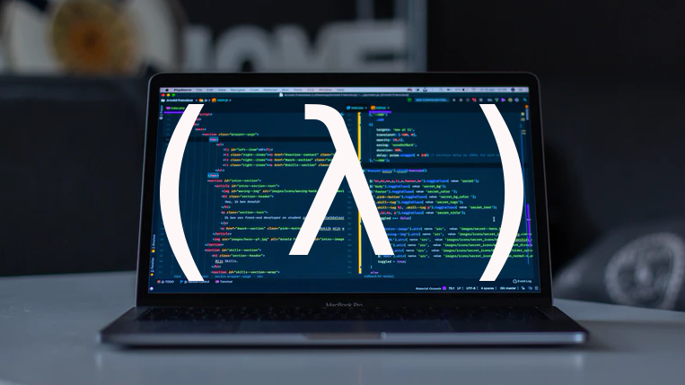

🕊

  <h2 align="center"> Common Lisp Programming </h2>
  <h3 align="center"> Learn Lisp effectively, in videos </h3>

  <a href="https://www.udemy.com/course/common-lisp-programming/?referralCode=2F3D698BBC4326F94358"><b> Homepage </b></a> |
  <a href="https://lisp-journey.gitlab.io/"><b> Blog </b></a> |
  <a href="https://twitter.com/vindarel"><b> Twitter </b></a> |
  <a href="https://ko-fi.com/vindarel"><b>Buy me a coffee!</b></a>

  <h4> Learn the Lisp language and its ecosystem, become an effective programmer and learn how to write real-world applications. Avoid all the traps that I faced during my journey! </h4>

Guys and girls, I really like Common Lisp, it is superior to many
languages out there (hello Python), but learning it isn't as easy as
it should be. Despite very good books, there aren't many online
resources, the languages has its peculiarities, the ecosystem is
larger than you think but not well structured. I contributed a *lot*
to written resources such as the
[Cookbook](https://lispcookbook.github.io/cl-cookbook/),
[awesome-cl](https://github.com/CodyReichert/awesome-cl) and my
[lisp-journey blog](https://lisp-journey.gitlab.io/) but I want to do more.

You can now **learn Common Lisp with my [videos on the Udemy platform](https://www.udemy.com/course/common-lisp-programming/?referralCode=2F3D698BBC4326F94358)**. At the time of writing, I consider it half done (but the chapters there are complete). If you subscribe now, you'll have access to the new content that I'm working on. I truly believe this course to be **the most effective way to learn Common Lisp today**. I am genuinely happy to share all that with you.

This course is the result of my experience writing new material, answering questions, and using CL in production© [^1]. I run my own small business [^2].

*Here's a [40% coupon for up until April, 18th](https://www.udemy.com/course/common-lisp-programming/?couponCode=220418-LISP-FOR-ALL).* *If you are a student, drop me a line for a free link.*

Here's what you'll learn.

  

## Content

*Total learning material: 2h36. Subtitles: english.*

0. **Introduction video**

> Short list of features. Companies using Common Lisp. Why this course.

> Everything that was hard to find for me, is presented and explained to you.

1. **Section 1: Getting Started**

1.1. Install SBCL [🆓 free preview]

> What we see: install the SBCL implementation (on a Debian system), start it, write "hello world", understand the output, add readline support to the SBCL default REPL in the terminal, disable the interactive debugger, a few words on Lisp implementations and GNU CLISP in particular.

1.2. Run Lisp code from your terminal, write code with a simple text editor

> What we see: we write a code snippet with a simple text editor and we run it with sbcl's --script and --load flags. We use the LOAD function to reload & recompile our file while we are still in the Lisp image.

1.3. Portacle: a portable, multiplatform, ready-to-use Common Lisp IDE

> Portacle allows to get started with a Common Lisp editor in 3 clicks, on Windows, MacOS and Linux. It provides: Emacs, SBCL, Quicklisp (the package manager), SLIME (the Superior Lisp Integration Mode for Emacs) as well as SLY, Git and Magit (the famous Emacs package). If you already know Emacs: you can stop watching at 9'. We first see: what is Portacle and where to get it, what it provides, some custom integrations (M-x create-project, the tree project explorer, company-mode and paredit-mode). Then, we continue with a more in-depth exploration, so you can find your way inside Emacs (buffer management, file management, Lisp code evaluation, how to create and quickload a project, Magit, how to use the help system…).

2. **Lisp Basics**

2.1. Lisp syntax and evaluation model [🆓 free preview]

*I got a whole brand new microphone for that one, sound is great!*

> What we see: the prefix notation. Everything is an expression. The evaluation model: no surprises with functions, but macros don't follow this model. Code is data is code.

2.2. Variables

> How to define variables, at the toplevel or locally. What we see: defparameter, defvar, let, let*, setf, how to lexically re-bind dynamic variables, the gotcha, the alternative (pure functions).

2.3 Conditionals

> What we see: if, when, unless, cond, case, the or shortcut, the #+(or) "\*features\*" trick, an example where we load a lispy configuration file.

3. **All about functions**

3.1. How to create named functions, how to handle all types of arguments [🆓 free preview]

> What we see: defun, returned values, required arguments, optional arguments, key arguments, how to set a default value, how to know if an argument was supplied, &rest, example of apply, example of an inline assertion under a feature flag.

3.2. Referencing functions, redefining functions locally, accessing documentation

> What we see: apropos, documentation #'hello, the difference between 'hello and #'hello (quote, sharpsign-quote), flet and labels.

3.3. Multiple Return Values

> Multiple return values are NOT like returning a list or a tuple!!! What we see: counter-example in Python, values, multiple-value-bind, nth-value, values-list, m-v-l.

3.4. Higher Order Functions

> What we see: how to give functions as arguments, member, the :test keyword, map and mapcar, lambda, how to generate functions, setf symbol-function. A word on currying and being a Lisp-2.

3.5. Closures

> What we see: closures (let over lambda and lambda over let over lambda). Notions of lexical scope, functions and their environment.

3.6. setf functions

> What we see: how and why setf functions, with our previous counter example and a circle class (we set a new radius given a circumference).

3.7. Generic Functions (quick intro, sneak peak to CLOS)

> How to write functions that dynamically dispatch on the type of their arguments. What we see (quickly): defmethod, defgeneric (optional).

## Who is this course for

This course is *not* for total newcomers in programming. You should know what variables and functions are.

Lisp newbies are welcome. I introduce Lisp basics (syntax, evaluation model…) to bootstrap you, but it's best if you know what is a language of the Lisp family.

This course is for young(ish) profesional developers like me, who feel they deserve a more fun, comfy, compiled and fast programming language.

It is for Python or JavaScript programmers frustrated by the unstability of their ecosystem,

for students of computer science who want to discover why Lisp still has un-matched alien technology inside.

It is for your friend or colleague.

## TODOs

More content:

- iteration (ongoing)
- systems and packages
- working with SLIME
- Atom and SLIMA
- condition system
- CLOS
- concurrency

And also:

- creating CLI apps
- web applications
- …

In parallel, I'd like to **create shorter videos on other topics**. I'll see if interest is here… and time… and revenue (creating videos takes soooooo much time).

## Issues

- sound: I got a new microphone for my last video, "Lisp syntax and evaluation model". The sound of the other videos isn't good enough. Fix it.

## Feedback

I would like very much to have your feedback on the course, alongside your background in programming in a few words.

If you want to correct my (cute) accent, be my guest!

## Conclusion

Learn CL *now* and use it *all your life*: code written 30 years ago still runs today O_o

And have fun! Lisp is amazing.

---

[^1]: For "glue" scripts as well as for web apps, used by real clients. Here the buzzwords: SOAP and FTP, XML parsing, DB handling, web scraping, Sentry reporting (empty dashboard!), email with Sendgrid, simple books catalogue web app…

[^2]: I don't earn millions so your support through Udemy helps me and helps consolidate the CL ecosystem. Thank you!
